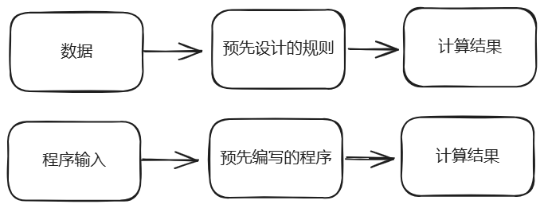
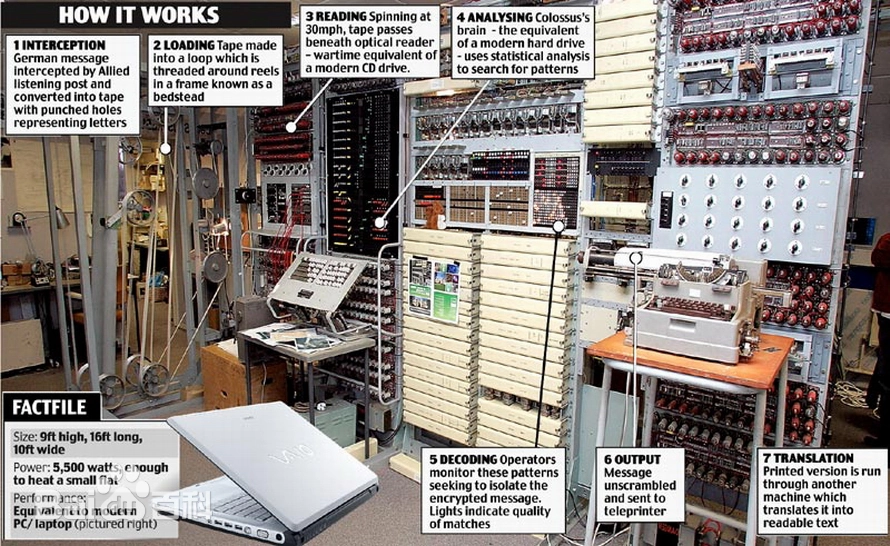
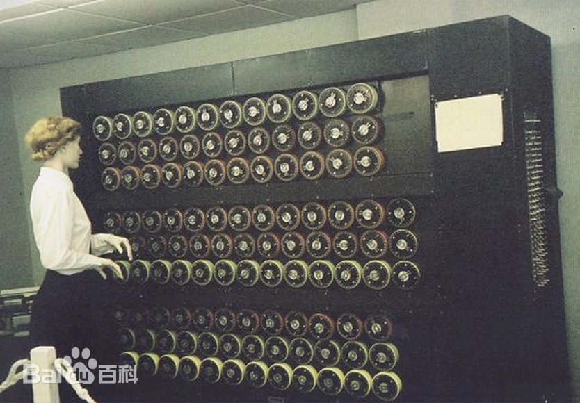
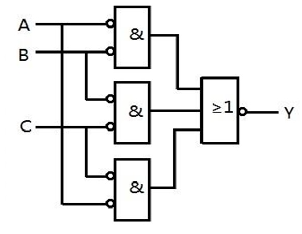
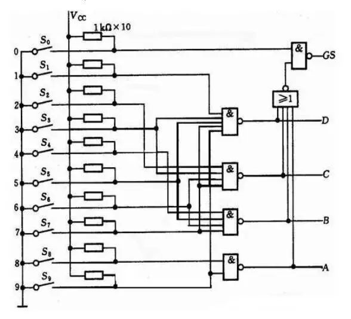
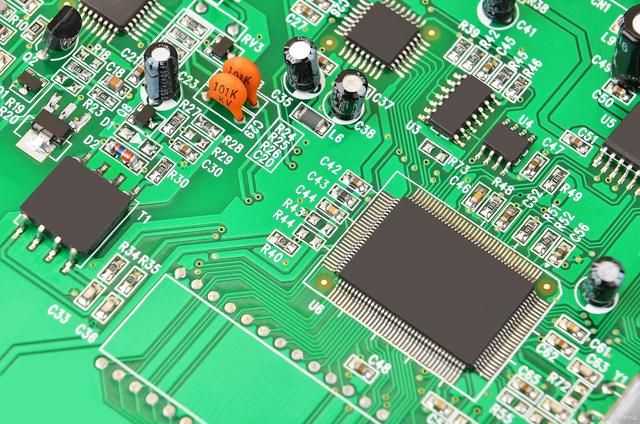
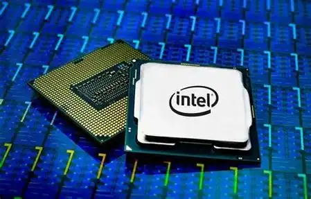

# 从半导体到计算机<Badge type="warning" text="主线1/2" />
## 图灵机：计算理论的起点

标题是从半导体开始的，把图灵机拿到最前面来的原因是，英国数学家艾伦·图灵被奉为计算机鼻祖，而整本手册讨论的都是计算机相关的技术（其实相当于开场先给祖师爷搬出来镇个场子:stuck_out_tongue:）。况且，图灵的两个众所周知的作品（图灵机模型和模仿游戏）又恰巧站在了技术演进层级金字塔的最底层和最顶层。仿佛从计算机领域诞生到现在一直在按照图灵的预想发展。如此讲述，整本手册就像是从图灵出发又回到图灵，也算是始终如一了。

> 1936年，英国数学家艾伦·图灵发表了一篇论文《论可计算数及其在判定问题上的应用》，在这篇论文中，他提出了“图灵机”的概念。图灵机是一种抽象的计算模型，它通过读取一条无限长的纸带上的一系列符号，并根据预设的规则进行操作来解决问题。虽然图灵机不是实际存在的机器，但它为计算理论和现代计算机科学提供了重要的理论基础。

这是一段AI给出的介绍。我们来白话翻译一下。图灵在论文中提到了一个模型，这个模型可以通过预先设计规则再向其输送数据的方式来解决计算问题。这句话听起来就是现在程序员干的活儿，预先设计的规则就是编写的程序，输送的数据就是程序的输入。可以参考下面的图：

简单的一个模型却催生了改变世界的计算机行业。用行话来说：图灵证明了一切可以用算法解决的问题都能用图灵机来实现。这也是现代计算机发展的重要理论基础。

艾伦·图灵在二战期间设计的 Bombe 和 Colossus 机器，间接的证明了图灵机的可行性，不仅在破解德国密码系统方面取得了巨大成功，还为计算机科学的发展奠定了基础。这些机器的成功应用不仅加速了盟军的胜利，还推动了密码学、计算机科学和人工智能等领域的发展。（这段历史被改变成电影《模仿游戏》<Badge type="tip">推荐观看</Badge>。）
值得注意的是，这两个机器是靠齿轮结构以及线缆和真空管（电子管）构成的，而真空管演变成半导体电子管催生了集成电路，使得计算机开始变成现实。

::: details 碎片关键词
* 图灵机
* 模仿游戏（既是理论也是电影名字）
* Bombe 和 Colossus
* 真空管 和 晶体管
:::

## 半导体：电子学的新纪元
先来看两张图片

这两张图片便是上个章节中提到的Colossus和Bombe了。组成他们的元器件中大量使用了真空管，也叫电子管。这种元器件有体积大、能耗高、寿命短等诸多缺点。所以当你查询历史的时候会发现世界上第一台可编程的机电式计算机ENIAC重约27吨，占地1800平方英尺（大约167平方米）。ENIAC使用了超过17000个真空管作为其主要电子元件。这也导致了其能源消耗大，元器件更换频繁，维护困难还不能移动。这显然是无法接受的，但当时仍然没什么好办法。直到晶体管的出现才让计算机变得更小、更快、更稳定变得可能。

> 这里先分清两个概念，上个世纪60年代左右流行的半导体收音机，其中的半导体指的是一种电学材料，它们的导电能力介于导体（如金属）和绝缘体（如陶瓷）之间所以叫半导体。而半导体材料做成的主要电子元件就是晶体管。

1947年，贝尔实验室的研究团队发明了晶体管，这是第一个实用的半导体器件。晶体管相比早期的真空电子管，具有体积小、能耗低、寿命长等优点，极大地促进了电子设备的小型化和便携化。随后，半导体技术不断进步，不仅催生了微电子学这一新学科，也为后来的集成电路和现代电子产品的诞生打下了坚实的基础。晶体管的出现使得制造更稳定、更耐用、更便宜的复杂电子器件成为可能，所以晶体管的出现也被视为现代电子技术的开端。

随着半导体技术的发展，逐渐出现了适用于高频电路的二极管、能对光亮产生反应的光敏二极管、能对磁场产生反应的霍尔元件等等诸多电子元器件。这意味着，通过半导体技术的加持，人们创造的机器同时有了**逻辑计算**和对外界信息的**感知能力**。这一点是非常重要的，从计算机到现在的AI万物互联，每一个领域无不利用了这两个能力。

但因为无法控制微小的电压，所以需要将电压放大后进行逻辑运算。而越大的电压就需要越粗的电缆。而数量庞大的电缆又会造成体积庞大的问题（当然除了电缆其他的元器件也没小到哪里去）。所以目前的计算机还是只有军事和科学上才能有机会接触使用。直到集成电路的出现，让体积小、性能高又耐用的电子产品成为可能。

::: tip
其实这段发展历史也是二进制在计算机中被普遍使用的原因，因为集成电路和半导体元器件可以量产后，恰好可以生产出适配莱布尼茨提出的二进制系统和符号语言设想（后面会讲到）的电子产品。同时成本也越来越低。
:::

::: details 碎片关键词
* 半导体材料
* 晶体管
* 二极管、光敏二极管、发光二极管、霍尔元件
* [罗会仟：室温超导之梦](https://self.kepu.net.cn/self_yj/201908/t20190813_482380.html)
:::

## 集成电路：电子工业的飞跃
**这是一个逻辑电路：**

**这是一个复杂的逻辑电路：**

一套系统可以由一组或多组电路构成，系统的功能越复杂，用到的电路模块就越多，电子元器件就越多。如果这些电路全部使用真空管和电线来实现，那么组成的计算机就会像上面介绍的**Colossus**一样，体积庞大，难以普及。集成电路的出现，让体积庞大的计算机成为了过去式。

> 1958年，德州仪器公司的工程师杰克·基尔比成功研制出了世界上第一块集成电路。这一发明将多个晶体管以及其他电子组件集成在一个小的硅片上，使得电子设备的功能更加复杂，同时体积和成本大幅下降。集成电路的出现是电子工业的一个重要转折点，它开启了大规模生产高性能电子产品的可能，也为计算机技术的快速发展铺平了道路。

**我们先来看看集成电路的样子：**

我们看到绿色板子上的深色线条就是电路中的导线，板子上密密麻麻的电子元器件组成了一整个集成电路（电路板）。而板子上的黑色方块（芯片、控制器），其内部也是类似这种电路板的集成电路；而且元器件数量更多，电路更复杂。

在集成电路快速发展的时期，电子元器件体积越来越小，单位面积的电路上集成的电子元器件数量越来越多。英特尔联合创始人戈登·摩尔（Gordon Moore）在1965年提出了一个观察和预测：**集成电路上可容纳的晶体管数量大约每两年翻一番，同时成本保持不变。后来，这个时间周期被调整为18个月左右。**就是是众所周知的**摩尔定律**了。

集成电路让人们一直探索和寻找的快速便捷的逻辑运算能力成为可能，融合了模块化思想和通用逻辑计算的需求，计算机最重要的两个组成开始出现：微处理器（CPU）和冯·诺依曼体系架构。

::: details 碎片关键词
* 逻辑电路
* 集成电路、电路板
* 摩尔定律和登纳德定律
:::

## CPU：计算机的大脑

从图灵机模型开始，科学家们就在不断地尝试实现一种机器，可以进行各种复杂的逻辑运算。
他们想象有一种机器，其中的程序可以不断地重复编辑，输入数据后可以进行快速的运算，完成各种复杂的数学运算、逻辑判断和数据传输任务。
而半导体元件和集成电路的出现让这种机器的体积越来越小，功耗越来越低，寿命越来越长。直到CPU的出现，让这种通用计算机器的形态定格成了芯片，直到今天仍是如此。

中央处理器（CPU）是计算机中最核心的部件之一，它负责执行程序中的指令序列，控制计算机的运行。1971年，英特尔公司推出了世界上第一款商用微处理器——Intel 4004，这是一款4位处理器，尽管性能有限，但它标志着CPU技术的重大突破。随着时间的推移，CPU的设计越来越先进，性能也越来越强大，成为现代计算机不可或缺的心脏。

这是CPU的样子，其内部是无数个晶体管组成的集成电路，用以完成各种各样通用的、快速的、复杂的计算任务。

::: tip
Intel 4004微处理器内部集成了2,250个晶体管。而Intel的酷睿i7处理器在几年前就已经集成了大约7.74亿个晶体管。
:::
有了CPU这种可重复编程的通用计算器件之后，人们很快就发现，通过跟各种控制器结合，可以更高效操控机器；通过跟输入、输出设备结合，可以更快更方便的重复编程；通过跟存储设备结合，可以更方便的调取和保存数据。但将这些设备全部像CPU一样集成在一个电路板中，会出现功能浪费、一个模块损坏不可替换维修成本高等问题。这时模块化思想指导科学家们开始创造一种可以按需自由组建和替换的计算机；其中哈佛结构和冯·诺依曼体系架构使用最为广泛，这两种结构思想被广泛应用在嵌入式设备和现代计算机中（当然随着时代的演进已经进行了诸多改进）。由于本章介绍的内容主要为计算机，所以后面着重介绍冯·诺依曼体系架构。

::: details 碎片关键词
* 微处理器（CPU）
* [魏少军：小小芯片，改变我们的生活](https://self.kepu.net.cn/self_yj/202205/t20220519_497100.html)
:::

## 冯·诺依曼体系架构：现代计算机的基石

其实前文提到的CPU的说法是不准确的，因为在计算机体系架构中才存在中央处理器的概念。
前文的描述只是为了容易理解，因为CPU的说法更为大众所知。

那么什么是计算机体系架构呢？通过前面的了解我们可以知道，微处理器已经具备了通用计算能力。但其实英特尔推出的4004是为了计算器设计的，没错就是那个归零归零的计算器。
当半导体技术和集成电路的快速发展，人们意识到，图灵机的理论正在一步步走向现实。可重复编程使用、低功耗、高寿命的需求可以被满足了。
于是拥有技术的商业公司开始着手研发更快、更小、更省钱的通用计算机。而这类计算机需要持续存储数据的能力、输入输出设备的快速连接、各种专用设备的接口以及便捷替换损坏模块的特性。
这时，冯·诺依曼原则（Von Neumann Principles），也可以叫做冯·诺依曼体系架构，发挥了关键的指导作用。

> 1945年，匈牙利裔美国数学家约翰·冯·诺伊曼提出了著名的冯·诺依曼体系架构。这一结构定义了计算机的基本组成部分，包括输入设备、输出设备、存储器、控制器和运算器，所有数据和指令都存储在同一个存储器中，由CPU统一管理和调度。冯·诺依曼体系架构的提出，对计算机的设计产生了深远的影响，至今仍是大多数计算机系统的标准架构。

冯·诺依曼体系架构所提出的单一存储器和数据总线概念，逐渐演变成现代计算机中主板的南北桥设计。而单一存储器中的指令和数据共用同一块物理存储器设想，使得程序可以作为数据存储在内存中，并由CPU逐条执行。这种设计极大地简化了硬件结构，并为高级编程语言的出现和发展奠定了基础。

简而言之，冯·诺依曼体系架构在现代计算机形成的软件和硬件领域都有着至关重要的影响。现代计算机和专业化设备中的主板设计基本上都是从冯·诺依曼体系架构改进而来。
另外冯·诺依曼体系架构并不是唯一的计算机指导思想。哈佛架构也是应用相对广泛的理论思想，主要用于嵌入式系统、数字信号处理、物联网设备、专用集成电路等领域。

::: details 碎片关键词
* 冯·诺依曼原则
* 哈佛架构
* EDVAC
:::

## 计算机：从大型机到现代计算机

> 计算机的历史可以追溯到20世纪40年代，当时的第一台电子计算机如ENIAC主要用于军事计算。
随着半导体和集成电路的发展，计算机逐渐从小型化、专业化走向大众化。1977年，苹果公司推出了Apple II个人电脑，这款电脑以其图形用户界面和丰富的软件支持迅速赢得了市场。此后，IBM PC及其兼容机的出现，进一步推动了个人电脑的普及，使得计算机成为了家庭和办公室中不可或缺的工具。

可以看出计算机最开始只被用于军事计算，后面拓展到科学领域。直到图形用户见面和丰富的软件出现才使得个人电脑得以普及，必经普通人不会有条件单独用一个屋子来装电脑，再每次花个几小时的时间编程来解决到底哪个菜市场卖得菜便宜的问题。

这个章节我们主要来介绍计算机的硬件部分，软件部分放在后面。

这是一张现代个人计算机主板的各部件标识图。这种设计就是上文所提到的冯·诺依曼体系架构的改进版。
* CPU负责处理和计算数据。
* 内存负责上电时存储数据。
* PCI-E总线是主板中各组件的通讯渠道。
* 北桥芯片负责处理高速度的设备之间的数据传输，如CPU、内存、显卡（通过AGP或PCIe接口）等。它直接连接到CPU，并为这些关键设备提供高速数据通道。
* 南桥芯片负责管理速度相对较低的外围设备和输入输出功能，如硬盘、USB接口、音频设备、网络接口等。南桥通过北桥与CPU间接通信，负责控制各种I/O设备的数据流。

::: tip
南北桥的叫法其实是主板中高速数据区和低速数据区的互通桥梁。个人觉得叫桥南、桥北芯片更好理解一点。目前也有将两个芯片合为一个芯片组的设计，让主板的面积更小。
:::

计算机主板使用了模块化设计来避免不同模块组件的损坏和升级更换的问题。它只规定了接口和通讯协议，那么符合此接口支持此协议的应将均可以连接使用。比如需要持久存储数据的硬盘，应该连接SATA接口，对应的通讯协议是SATA协议。那么当硬盘损坏或需要升级更换时，直接在市场上寻找SATA接口、SATA协议的硬盘购买即可。

::: tip
主板支持的通讯协议有很多种，相同的接口也可以有多种协议，这些是由主板的操作系统BISO决定的。这部分放在软件部分介绍。
:::

基于标准硬件接口和通讯协议的设计，现代计算机的各个部分都有不同的公司并行研发，致使计算机的计算速度、数据传输速度等各项能力获得了飞速的提升。而基于人们各种各样的需求，可移动的笔记本电脑、便携的可穿戴设备（智能手表、眼镜等）、控制机器的物联网设备（车机、智能家居）相继出现。计算机逐渐将各行各业重塑，人们把这种现象成为数字化、信息化。

::: tip
随着材料科学和能源技术的不断进步，新的理论和技术终将颠覆现有的产品格局。例如，我国目前领先的“九章”超算集群便是这一趋势的体现。当能源和材料问题得到有效解决时，量子计算机和量子通信等前沿技术必将重塑整个计算机领域。
:::

::: details 碎片关键词
* 现代计算机主板
* PCI-E总线
* 主板的南北桥设计
* 主板的硬件接口和协议
:::

## 总结

尽管计算理论层出不穷，但在制造技术和经济因素的双重制约下，最终在市场上独占鳌头的计算机往往只有一种。即使是这样一种设计，本文篇幅的十倍也难以穷尽其万一，难以全面展现这座飞速发展的技术冰山的全貌。

从图灵机到个人电脑，这段历史不仅是技术发展的波澜壮阔的画卷，更是人类智慧和创造力的淋漓尽致的展现。每一个关键词背后，都凝聚着无数科学家和技术人员的心血结晶与不懈努力。希望本篇文档能为想了解计算机技术的朋友拨云见日，提供清晰的指引。

