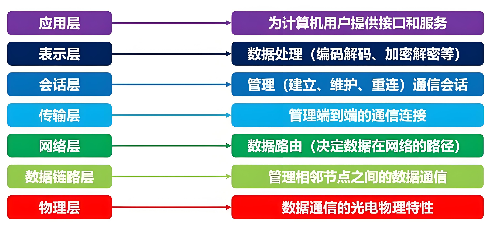
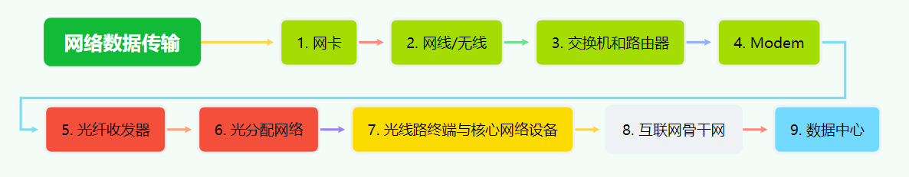

# 信息互通<Badge type="warning" text="主线3/3" />

## Internet发展史源自数据互通需求
在计算机诞生之初，它们主要用于独立完成任务，比如计算复杂的数学问题或处理大量数据。但随着技术的发展，人们意识到，如果计算机之间能够互相通信，将会极大地提高效率。于是，数据互通的需求推动了互联网的诞生。

最早的互联网雏形是1960年代的ARPANET，它连接了几所大学和研究机构的计算机，目的是共享资源和信息。随着时间的推移，互联网逐渐演变成我们今天所熟悉的全球网络。它的核心目标始终是：让信息在不同设备之间高效、可靠地传输。

## 经典的OSI模型 {#OSI}
为了实现信息互通，计算机需要遵循一定的规则和标准。这些规则被总结为一个经典的框架，叫做OSI模型（Open Systems Interconnection Model）。OSI模型将信息传输的过程分为七层，每一层都有特定的功能。我们可以把它想象成一个分工明确的工厂流水线：

1. 物理层：负责将数据转换成电信号、光信号或无线电波，通过物理介质（如网线、光纤）传输。
2. 数据链路层：确保数据在相邻设备之间可靠传输，比如纠正传输中的错误。
3. 网络层：决定数据从源头到目的地的路径（比如通过路由器）。
4. 传输层：确保数据完整、有序地到达目的地（比如通过TCP协议）。
5. 会话层：管理设备之间的通信会话。
6. 表示层：将数据转换成适合传输的格式（比如加密或压缩）。
7. 应用层：直接面向用户，提供具体的服务（比如网页浏览、电子邮件）。

虽然OSI模型有七层，但这里我们主要关注最底层-物理层：信息互通的本源。

## 从家庭中常用的网络连接设备初步了解
网络连接看似复杂，但其实它是由一系列硬件设备组成的“链条”。我们可以从家庭中常见的设备开始，逐步了解数据是如何从你的电脑传输到互联网的。

###  家中设备：

1. 从电脑网卡开始
当你用电脑上网时，数据首先通过**网卡（Network Interface Card, NIC）**发送出去。网卡是电脑连接网络的硬件设备，它负责将数据转换成适合传输的信号。如果你的电脑是通过Wi-Fi连接的，那么网卡会通过无线电波发送数据；如果是有线连接，网卡则会通过网线发送电信号。

2. 网线：数据的“传输通道”
如果你使用的是有线网络，数据会通过网线传输。网线是连接电脑和路由器（或交换机）的物理介质，通常是以太网电缆。它的内部有多根铜线，负责传输电信号。网线的质量和长度会影响网络的速度和稳定性。

::: tip
我们在生活中听到的有线和无线网络的线指的就是这个网线，如果是手机、可穿戴设备之类的无线，这里的传输介质就是无线电磁波了。
:::

3. 路由器和交换机：家庭网络的“交通枢纽”
数据从电脑发出后，会到达路由器或交换机。
* 交换机：如果你家里有多台设备通过网线连接，交换机可以帮助这些设备互相通信。它比路由器更简单，主要用于局域网内的数据传输。
* 路由器：是家庭网络的核心设备，它负责将数据从你的家庭网络发送到互联网，同时也能将互联网的数据发送回你的设备。路由器还负责分配IP地址，确保每台设备都能正确接收数据。

::: tip
如果多台设备只在同一个网段交换数据那么交换机就可以了。如果数据传输跨越了网段，那就需要使用路由器了。网段的概念会在后面软件的部分中TCP/IP概念中再次提及。也可以查看本章最后的碎片关键词中的视频来做进一步了解。
:::

4. Modem：连接家庭与互联网的“桥梁”
路由器通常连接到一个叫做**Modem（调制解调器）**的设备。Modem的作用是将家庭网络的数据转换成适合通过电话线、光纤或电缆传输的信号。如果你的网络是通过光纤接入的，Modem会将电信号转换成光信号。

::: tip
生活中常听到的`光猫`其实就是这个Modem。
:::

### 从家中设备出来后的传输链路：

5. 光纤收发器：光信号的“翻译官”
如果你的家庭网络是通过光纤接入的，数据会通过光纤收发器传输。光纤收发器负责将电信号转换成光信号，并通过光纤传输到更远的距离。光纤的传输速度非常快，适合长距离通信。

6. 光分配网络：光纤的“分叉路口”
数据通过光纤传输到光分配网络（ODN）。光分配网络是一个由光纤和分光器组成的系统，它可以将光信号分配到多个用户家中。你可以把它想象成一个“分叉路口”，将主干光纤的信号分配到各个家庭。

### IPS机房：

7. 光线路终端与核心网络设备
数据从光分配网络传输到ISP（互联网服务提供商）的机房。在这里，光信号会通过光线路终端（OLT）设备转换回电信号。然后，数据会进入核心网络设备，这些设备负责将数据转发到互联网的骨干网。

### 外部网络：

8. 互联网骨干网：数据的“高速公路”
互联网骨干网是由高速光纤和核心路由器组成的全球性网络。它就像一条“高速公路”，将数据从你的家庭网络传输到世界各地的服务器。骨干网的传输速度非常快，可以同时处理海量数据。

### 网络服务机房：
9. 网络服务的数据中心：数据的“终点站”
最终，数据会到达网络服务机房的数据中心。数据中心是存储和处理大量数据的设施，里面有许多服务器和存储设备。当你访问一个网站时，数据就是从这些服务器发送到你的设备的。

## 总结
本章并没有着重介绍历史而是从生活中常见的设备由浅入深，主要的原因是因为我的网络知识太匮乏了。无论是历史还是深度，我都没有信心能讲的明白。不过在后面的碎片关键词里，推荐了一些符合主题的视频，可以深入了解。

计算机的数据互通是互联网发展的需求本源，更快、更准、更方便的网络随着时代在不断演进，数据的互通会随着技术发展越来越容易,数据的传输通道会逐渐从有形向无形转化，从多层向点对点转化。

::: details 碎片关键词
* [你管这破玩应叫网络？@飞天闪客](https://www.douyin.com/video/7453855860079578395)
* [网络中国：第一集 科技的引领](https://v.kepu.net.cn/df/202207/t20220711_498802.html)
* [网络中国：第二集 创新的力量](https://v.kepu.net.cn/df/202207/t20220711_498820.html)
* [网络中国：第三集 跨越的前奏](https://v.kepu.net.cn/df/202207/t20220711_498821.html)
* [龙桂鲁：神奇的量子通信](https://v.kepu.net.cn/mooc/gzld/202207/t20220714_501503.html)
:::