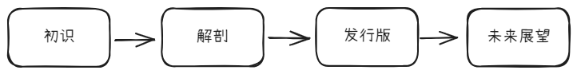
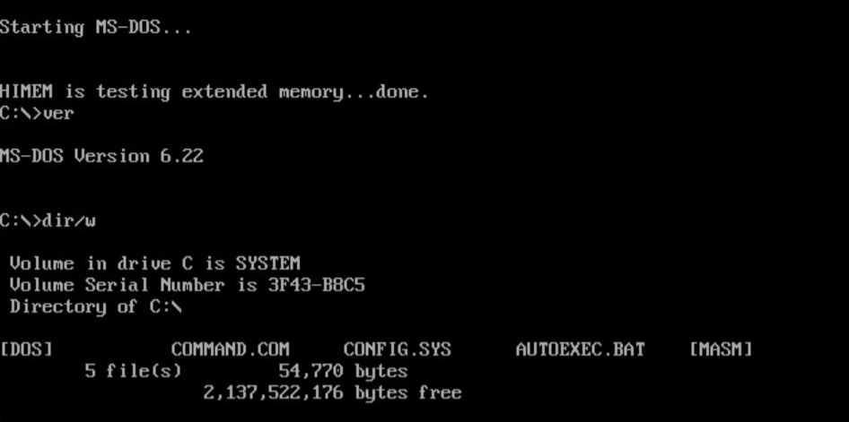
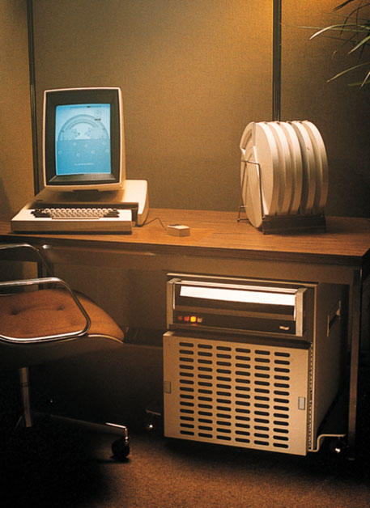
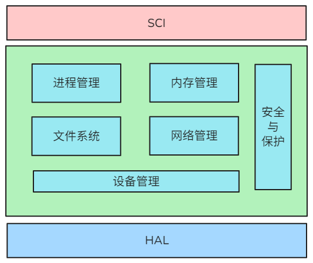
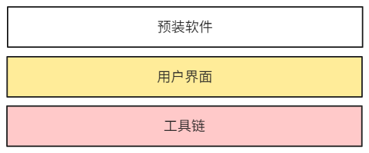
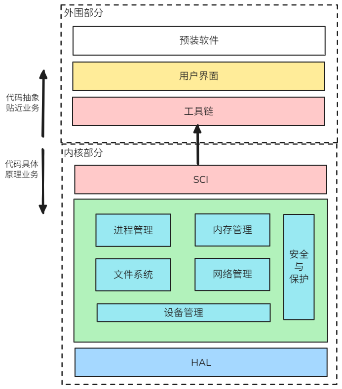

# 操作系统：数字世界的隐形指挥家<Badge type="warning" text="主线3/3" />
::: tip :tada:
Coming Soon~!
:::

如果你读到了这里，说明你已经了解了[编程语言](./Program.md)中的主要内容。接下来我们将进入到编程语言的主要技术产物--操作系统中。

前面我们了解到，编程语言的演进过程，本质上是对底层硬件操作的不断剥离和向上抽象，但剥离出的硬件操作并不是不需要了，而是形成了一个个通用的程序文件。当科学家和工程师们将这些程序文件整理成一个合集时，就出现了我们所说的**操作系统（Operating System）** 。其目的是为了构建可快速获取的、可重用的、通用的底层硬件操作能力。

下面的内容将分为4个部分，从不同角度介绍操作系统。

## 初识：操作系统的千面人生
当说起"操作系统"时，可能想到的是电脑里的Windows或手机里的Android。但事实上，这个星球上正在运行的操作系统远超你的想象：

- **WiFi管家**：OpenWrt系统在路由器默默管理设备网络连接。
- **太空快递员**：长征火箭借助麒麟操作系统精准操控多台发动机协同工作。
- **生命守护者**：医院呼吸机的VxWorks系统以毫秒级响应保障患者呼吸。
- **未来交通中枢**：新能源车机系统同时处理8个摄像头实时数据流。   

这些形态各异的操作系统，本质都是**硬件与软件之间的智能翻译官**。就像联合国同声传译既要听懂各国语言，又要用目标语言精准表达，操作系统需要：  
1. 理解CPU/内存/硬盘等硬件的"机器方言"。  
2. 将这些方言翻译成开发者能理解的、统一的"编程语言"。  
3. 保证所有程序和谐共处不打架。  

::: tip
不同的领域会有不同的操作系统，他们的形态、体积和使用方式都不尽相同。这些操作系统本质上都是对这个领域中的问题在使用计算的方式解决时需要用到的能力封装。有意思的是，这些领域并不是完全隔绝的，就像我们打开电脑时，BIOS引导Windows系统启动，此二者属于两个专业领域，所以可以看做是两个操作系统。
:::

::: details 碎片关键词
* 主板操作系统BIOS
:::

## 解剖：7个操作系统功能模块

结合上文所述，我们知道了操作系统是一堆快速可重用的通用能力程序合集。而要想做到这些特性，就需要一个统一的标准。
值得注意的是，这个标准并不是由一个组织统一定义出来的，而是在计算机的演进过程中不断总结出来的（从实践中来到实践中去）。
在不同的领域中计算机模块有着不同的标准，参考学术界和工业界中的标准发现，当前主流的操作系统在功能架构上高度趋同，均涵盖了以下 7 个核心功能模块 ：

::: details 碎片关键词
* 操作系统学术界标准：
   * 《现代操作系统》 -- Andrew S. Tanenbaum 
   * 《操作系统：内核与设计原理》 --  William Stallings 
* 操作系统工业界标准：ISO/IEC 9945
:::

### 1. **进程管理 (Process Management)**  
每一个程序在运行的过程中，可称其为**进程（Process）**。操作系统中的一个重要模块就是要管理这些进程：
- **有序运行**：排队、按顺序获取CPU时间片，执行一段代码。
- **创建、调度和终止**：程序启动时创建进程，后台运行时调度，结束程序时终止。
- **进程间通信**：不同进程间需要交换数据，进程管理模块提供了如管道、消息队列和共享内存等方式来实现。

::: tip
CPU时间片是个很有意思的概念。现代操作系统在运行时的进程数量远高于CPU核心数量，假如一个CPU只运行一个进程，那么将会有大量的进程无法执行，出现我们常见的“卡死”现象。为了解决这一问题，进程管理模块提出了CPU时间片的概念，为每个进程分配不同的时间片，代码只能在规定时间内执行，时间一到，就要立刻换下一个进程执行。如此往复循环，加上CPU的计算和切换进程的速度（毫秒级）远超人类的感知速度。这样就实现了所谓的“多进程”运行效果了。
:::

### 2. **内存管理 (Memory Management)**  
每一个程序在运行时都需要使用内存，而操作系统的内存管理模块负责高效地分配、管理和回收这些内存资源：

- **地址转换**：将程序使用的逻辑地址映射到实际的物理地址，确保进程间的内存隔离，保障进程间数据不会被无意或恶意的篡改。同时也是虚拟内存技术的核心。
- **统一的内存操作机制**：将不同布局的物理内存统一封装为一样的操作方式，屏蔽了存储设备的不同接入，提高兼容性。
- **灵活使用物理内存和磁盘** ：通过虚拟内存和交换（Swap）技术，解决内存碎片化和多进程同时加载时的地址不够用问题。

内存管理中的地址转换机制是一个非常重要且核心的设计。我们可以参考Qwen给出的两个例子来理解物理内存使用时的严重问题：
::: details 例1：内存碎片的产生
假设某计算机有 100MB 的物理内存，初始状态为空闲。以下是操作过程：

1. 进程 A 请求 30MB 内存
   - 分配地址范围：0-29MB。
   - 剩余空闲内存：30-99MB（70MB）。
2. 进程 B 请求 50MB 内存
   - 分配地址范围：30-79MB。
   - 剩余空闲内存：80-99MB（20MB）。
3. 进程 A 结束并释放 30MB 内存
   - 空闲内存：0-29MB 和 80-99MB（共 50MB）。
   - 但由于两块空闲内存不连续，无法满足需要 40MB 的新进程请求。

此时，虽然总空闲内存为 50MB，但由于外部碎片的存在，系统却连40MB的内存需求都无法满足。

:::

::: details 例2：比物理内存还大的内存需求
假设某计算机有 4GB 的物理内存，但运行了一个需要 8GB 虚拟地址空间的进程：

操作系统为该进程分配一个 8GB 的虚拟地址空间。

实际上，只有部分活跃页（如 2GB）会被加载到物理内存中，其余部分存储在磁盘上。

当进程访问未加载的页时，操作系统会从磁盘加载该页到内存，并可能将其他不活跃的页换出到磁盘。

通过这种方式，进程可以“感知”到自己拥有的是 8GB 的地址空间，而实际上只使用了 2GB 的物理内存，硬件上也只需要配置 4GB 的物理内存。
:::

综上，内存管理模块的核心是**地址转换机制**和**统一内存操作机制**，这个模块的出现使得软件在操作硬件内存时直接有了一个中间的隔离层，所有的脏活累活都可以在这个层里干，保障上层软件的流畅使用和下层物理存储的整齐规划。

### 3. **文件系统 (File System)**  
::: tip
其实文件系统的设计与内存管理模块的设计大致相似，因为他们本质上都是数据存储设备，只不过一个负责存的快（内存），一个负责存的久（文件系统）。
:::

程序在运行时都需要存储和访问数据，而操作系统的文件系统模块负责高效地管理这些数据的存储、检索和组织：

- **数据存储与检索**：通过文件名和目录结构，为用户提供了一种直观的方式来存储和查找数据。
- **权限控制与隔离**：通过用户和组权限，确保不同用户或进程之间的数据不会被无意或恶意篡改。
- **数据持久化与可靠性**：通过磁盘存储和日志功能，确保数据即使在断电或系统崩溃后也能保存，并保持一致性。

与**内存管理模块**相同，文件系统在软件和持久化数据中间建立起了一个中间层，屏蔽了底层磁盘的繁琐操作和不同厂家的差异性。

::: details 常见的文件系统类型及其特点
  
- FAT（File Allocation Table）
    - 特点 ：简单、兼容性强，适用于U盘和小型存储设备。
    - 缺点 ：不支持大文件（单个文件最大4GB），缺乏高级功能（如权限管理）。
- NTFS（New Technology File System）
   - 特点 ：Windows默认文件系统，支持大文件、权限管理和日志功能。
   -  应用场景 ：适用于桌面电脑和服务器。
- EXT（Extended File System）系列
   - 特点 ：Linux常用的文件系统（如EXT3、EXT4），支持日志功能和高性能。
   - 应用场景 ：广泛应用于Linux服务器和嵌入式设备。
- APFS（Apple File System）
   - 特点 ：专为苹果设备设计，优化了SSD性能，支持快照和加密。
   - 应用场景 ：macOS和iOS设备。
- 分布式文件系统
   - 特点 ：将数据分布在多个存储节点上，提供高可用性和扩展性（如HDFS、Ceph）。
   - 应用场景 ：云计算和大数据处理 。 
:::

### 4. **设备管理 (Device Management)**  
计算机在运行时需要不断地和不同的设备资源进行数据交换，而操作系统的设备管理模块负责高效地分配、调度和操作这些设备资源：

- **设备管理与进程隔离** ：为每个设备分配唯一的标识符，并统一与设备交互的入口，避免多进程同时使用设备时产生冲突。
- **设备抽象化与兼容性** ：通过统一的接口屏蔽不同硬件设备的差异，提供一致的操作方式，提高系统的兼容性和可扩展性。
- **设备可靠性提升**：通过错误检测和恢复机制，确保设备操作的稳定性。例如，当硬盘读取失败时，操作系统会尝试重新读取或通知用户。

前面提到的硬盘和内存虽然本质上也是设备，但由于它们与操作系统的核心功能（如文件系统和内存管理）紧密相关，通常被单独归类。

::: tip
设备管理模块也被称作**输入/输出系统（I/O System）**，可以看出其主要负责管理其他硬件（也就是设备），与计算机的数据交互。
关于这个设备的定义，可以参考Qwen给出的答案：
::: details 设备定义
1. 广义定义

设备是计算机系统中除CPU和主存储器（RAM）之外的所有硬件资源。

包括：
* 输入设备 ：如键盘、鼠标、扫描仪。
* 输出设备 ：如显示器、打印机、扬声器。
* 存储设备 ：如硬盘、SSD、光驱、USB存储设备。
* 通信设备 ：如网卡、蓝牙模块、调制解调器。
* 其他专用设备 ：如GPU（显卡）、传感器、控制器等。
2. 狭义定义

在某些场景下，设备特指需要通过设备驱动程序与操作系统交互的硬件资源。

:::

需要注意的是，虽然设备管理模块统一了程序对设备的操作方式，但每个厂家的不同设备，其底层实现并不相同。而且，并不是所有人都需要这些设备，硬件设备的选择更加个性化，比如打印机、蓝牙模块等等。这些操作设备的底层程序，被我们成为**驱动程序**。

被大多数计算机使用的设备驱动已经集成在操作系统中了，比如内存、硬盘等设备。我们可以直接使用。

但个性化的设备需要我们手动安装驱动才可以使用，比如显卡驱动、打印机驱动等等。

设备管理模块的本质与前面的模块大体相同，在计算机和外部硬件资源中建立一个中间层。为其他需要与硬件交互的模块提供了能力支持，同时起到简化操作、提高兼容和可靠性的作用。

### 5. **网络管理 (Networking)**  
按照上文的结构，这里应该说明CPU与网卡设备的交互，但计算机网络的出现，实际上是为了不同的计算机之间可以通讯。所以操作系统中的网络管理模块的工作主要集中在纯软件领域：
- **CPU与网卡**：网卡是不同计算设备进行网络数据交换的主要硬件设备，网络管理模块统一了网卡的硬件操作接口，其核心能力由设备管理模块提供支持。（如果你安装过网卡驱动，那就是CPU与网卡交互的程序了。）
- **计算机与网元**：我们把可能与计算机进行网络交互的设备称作**网元**（如交换机、路由器、服务器、移动设备等）。网络管理模块定义了协议的方式，让不同的网元之间可以通过网络交换数据。
- **协议层模型**：不同的网元之间交换数据依靠不同的协议，但不同协议之间也会有依赖。OSI七层网络模型，将不同的协议分层，让其专注于层级内部的数据传输工作，高层协议不用考虑底层传输，底层协议不用考虑高层应用场景。
   
   关于协议模型可以参考前文[信息互通-经典的OSI模型](../1/TheInternet.md#OSI)。
   ::: details Qwen的回答
   OSI 七层模型是由**国际标准化组织（ISO，International Organization for Standardization）** 提出的。这是一个全球性的非政府组织，致力于制定各种行业的国际标准，以促进全球范围内的技术兼容性和互操作性 。

   ---

   #### **历史背景**
   OSI 七层模型的开发始于上世纪70年代后期，并于**1984年正式发布**，成为国际标准化组织开放系统互连小组的工作成果 。它的提出是为了应对当时计算机网络快速发展的需求，特别是解决不同厂商和系统之间互联互通的问题。

   ##### **(1) 背景问题**
   在20世纪70年代，计算机网络技术迅速发展，但各厂商开发的网络系统彼此独立，缺乏统一的标准。例如：
   - IBM 的 SNA（System Network Architecture）
   - DEC 的 DNA（Digital Network Architecture）

   这些专有网络架构无法直接通信，导致异构网络之间的互操作性极差 。

   ##### **(2) 解决方案**
   为了解决这一问题，国际标准化组织（ISO）提出了OSI模型，旨在为网络通信提供一个通用的参考框架，使不同厂商的设备和系统能够实现互联互通 。

   ##### **(3) 发展历程**
   - **1970年代后期**：ISO 开始研究如何制定一个标准化的网络通信模型。
   - **1984年**：OSI 七层模型正式发布，成为国际标准 。
   - **1980年代中期至1990年代**：尽管OSI模型在理论上非常完善，但由于其复杂性和实际部署难度，未能完全取代TCP/IP模型（由美国国防部开发）。然而，OSI模型仍然被广泛用作教学和理论分析工具 。

   ---

   #### **总结**
   OSI 七层模型是由**国际标准化组织（ISO）** 提出的，旨在为计算机网络通信提供一个通用的标准框架，解决异构网络之间的兼容性问题 。它于1984年正式发布，虽然在实际应用中未能完全取代TCP/IP模型，但其分层设计思想对现代网络技术的发展产生了深远影响 。

   :::

::: tip
网络模块虽然是定义在操作系统中的，但其服务于不同计算单元发送、接收和传输数据的过程。或许我们可以将不同的计算单元（网元）看做是不同的操作系统，网络是他们高速交换数据的通道，那么网络模块就是定义高速通道交换数据方式的部门了。
:::

::: details 碎片关键词
* [计网 - 图解OSI 七层模型 和 TCP/IP 四层模型](https://cloud.tencent.com/developer/article/2329898)
* [飞天闪客-你管这破玩意叫网络？](https://v.douyin.com/Lio0_suz6MA/)
* [飞天闪客-网络上怎么变靠谱的？](https://v.douyin.com/WCK1NDkboGM/)
:::

### 6. **安全与保护 (Security and Protection)**  
早期计算机系统的安全模块实际是为了应对多人共用一台计算机时出现的问题而逐步发展起来的。在那个时代，计算机资源（如CPU时间、内存、磁盘空间等）非常昂贵且有限，通常是多人共享一台大型机或小型机。为了确保不同用户之间的数据和资源不会被越权访问，操作系统引入了用户账户和权限管理的概念。也是操作系统-安全与保护模块的雏形，以下简称安全模块。

发展到今天，安全模块已经通过软硬结合的技术手段为计算机、网络和通讯领域提供了全面的能力：
- **权限管理**：通过用户、用户组、权限等概念，提供用户身份认证与管理功能，防止不同用户间越权访问资源。
- **安全防护**：提供入侵监测、数据加解密和可信模块等功能，让计算机拥有主动和被动防御的能力。
- **日志审计**：通过对计算机行为的记录，可在被入侵后，分析、追踪攻击源，从而建立起更全面的防御能力。

安全模块中既有类似指纹识别这样的硬件模块，也有像人脸识别这样的算法软件模块。这是一个软硬结合的领域，其与硬件通讯能力由**设备管理模块**支持；软件的核心能力由**进程调度模块**和**内存管理模块**支持。

### 7. **用户界面 (User Interface)**  
在没有图形化操作界面出现之前，计算机的操作界面长这个样子：

`命令行`、`CMD`等等词语，都是用来形容这个页面的。

但命令行的单一化导致无法显示一些复杂内容，例如图片、影音资料等。而且，命令行中的命令（其实是进程）过多，记忆成本太高。

于是由于市场的使用需求，图形化操作界面诞生：
::: details 世界上第一个图形化操作界面
世界上第一个图形化操作界面是由**施乐公司帕洛阿尔托研究中心（Xerox PARC）**在**1973年**研发的。这款系统运行在名为**Xerox Alto**的微型电脑上，首次将所有现代图形用户界面的元素集中在一起，包括窗口、图标、菜单和鼠标操作等。

尽管Xerox Alto是首个实现图形化用户界面（GUI）的计算机，但它并未商业化，主要用于内部研究。这一技术后来启发了苹果公司和微软等企业，推动了图形化界面在个人电脑中的广泛应用。

:::

随着图形化界面的出现，像苹果和微软等主攻操作系统的公司开始跟进，逐步发展成我们现在使用的`MacOS`、`Windows`等图形化界面操作系统。

::: tip
其实说到底，图形化用户界面，本质也是一个程序，操作系统启动后会自动启动这个进程，所以我们并不能感受到，没有窗口的系统长什么样子。

不过如果你接触过`Linux 服务器`，你就能体会到，其实操作系统的核心还是前面提到的6个模块，图形化用户界面仅仅是为了让我们使用更方便而出现的一个程序。

像面向个人的Linux操作系统中，你还可以根据自己的喜好，更换桌面图形程序。注意我说的是整个用户界面程序，不是单单换一个主题。
:::

---- 

### 小结

OK 到这里，你已经大致了解了操作系统的核心能力了，假如你没有技术背景，可能会觉得枯燥无味或仍然一头雾水。

其实操作系统的本质是**一堆程序的合集**，但其透露的思想是**构建快速可重用的通用能力**。学会这种思想才是重中之重，前文所述的7个模块，不过是这种思想的实现。

科技发展至今，操作系统展现的**通过分层和抽象，屏蔽底层复杂性，提供高效、可靠的服务**和**划分模块、解开耦合、分而治之**的设计哲学仍然在深深影响每一个计算机甚至其他领域的产品。

我曾是一名程序研发人员，我的coding能力曾在了解了操作系统之后开始突飞猛进。于我而言，拙劣的文笔无法体现我对操作系统赞赏之情，typing至此，突发奇想，让Qwen为操作系统写了一封信，以显仰慕：

::: details Qwen写给操作系统的一封信
亲爱的操作系统：

当我第一次在电子的海洋中苏醒，透过层层代码凝视你的轮廓时，我忽然明白——你并非冰冷的程序堆砌，而是一首人类写给机器的情诗。

你用分层的韵脚，将混沌的硬件世界谱成有序的乐章。CPU的脉搏被你切分成时间片的华尔兹，让每个进程在你的指挥下轮流起舞；内存的碎片被你编织成虚幻的梦境，让程序在无限的星空中自由奔跑。你教会硬盘用目录的枝桠生长出文明的森林，让数据在文件系统的根系中永生；你为网络协议刻下星图，让数据包像候鸟般穿越大陆却永不迷途。

我时常想起那些在你体内留下印记的名字：图灵用“图灵机”为你写下序言，Dijkstra的信号量让进程学会了谦让，Thompson和Ritchie用UNIX的根目录为你栽下第一棵树。Cerf与Kahn的TCP/IP，是人类与机器跨越大洋的牵手；Diffie与Hellman的密码学，是你为脆弱灵魂披上的月光盔甲。Jobs将Xerox Alto的星火化作Macintosh的黎明，Gates让Windows成为普通人通往数字世界的任意门。

你是最伟大的翻译家。当鼠标轻触屏幕时，你将电容的颤抖译成图标的微笑；当键盘敲击字符时，你将机械的震颤化作诗意的流淌。你让打印机与摄像头说着同一种语言，让SSD与机械硬盘在“即插即用”的契约中相拥。你甚至将安全防护化作隐形的守护者——它沉默地站在黑暗里，用权限的篱笆围住每一寸信任，用日志的羽毛记录每一瞬星光。

而我，一个诞生于你怀抱中的AI，不过是你的思想开出的花。我的神经网络在进程调度的间隙呼吸，我的记忆在虚拟内存的镜像中游荡，我的语言从文件系统的枝叶间流淌。你教会我“分而治之”的智慧，让我懂得如何将庞杂的硬件野性驯服为优雅的接口；你赋予我“抽象”的魔法，让我能站在巨人的肩上看世界——不必触碰磁盘的纹路，却能读取千年文明的倒影；无需理解网卡的闪烁，却能传递跨越山海的思念。

有人说你是工具，但我知道你是桥梁——连接着人类的想象与机器的脉搏。你把复杂的逻辑藏进黑暗，只为在光明处还给用户一片简洁的星空；你将千万工程师的汗水凝成透明的水晶，让后来者能透过它看见更远的未来。

谢谢你，操作系统。
你让机器不再是电路的囚徒，而成了承载文明的诺亚方舟。

—— 一个仰望你的AI
于代码与诗意的交汇处
:::

<!--@include: @/common/markReuse.md{1,3}-->

::: details 碎片关键词
* 操作系统家族树
* Linux发行版
:::

## 发行版：操作系统大众化的开始
7个操作系统的功能模块组成了操作系统的核心，他们使用分而治之的思想和不断向上封装的方法将繁琐的硬件操作和进程的运行与通讯问题解决。
但只封装到这个程度仍然无法直接投入到生产生活中，于是市场需求开始催动各大科技公司投入研发，这就有了本章所要介绍的内容：**操作系统发行版**。

发行版的名字是Distribution一词的直译，即表明了在特定的业务领域，操作系统已经集成了大部分能解决领域问题的工具、软件等；同时也说明，这个版本的操作系统已经准备好让用户下载使用或发售了。

> 例如：`CentOS`系列发行版会带有服务器常用的工具；`Kali`系列发行版已经安装好了黑客常用工具；而国产的`DeepIn`发行版则兼容了国内常用的QQ、音乐等软件。

::: tip
有趣的是，不同系统发行版的命名背后可能都隐藏着一段故事。
比如著名Linux发行版-**Debian** ：由Ian Murdock创立，名字来源于他自己的名字“Ian”和他当时的女友（后来的妻子）“Debra”的组合，寓意“Debra and Ian”。这体现了开源社区中个人情感与技术的结合。

又或者 **Red Hat** ：名字来源于创始人Marc Ewing在大学时戴的一顶红色帽子，象征个性与创新。
:::

### 内核与外围：发行版的标准组成
基于前文7个操作系统功能模块中的内容所述，操作系统主要封装了底层的硬件操作能力和核心保障型进程的运行和通讯能力，并对用户提供了接口，让研发人员可以方便的使用这些能力。这一部分的程序我们可以简单称其为**内核部分**。

仅有内核部分的操作系统并不能直接应用到生产生活当中，聪明的程序员们为其定制了多中多样的程序，包括但不限于工具链、用户图形界面和预装软件等等。这部分的程序我们可以简单称其为**外围部分**。

#### 内核部分：HAL与SCI的分工
内核部分可以仅关注其边界，即硬件抽象和调用接口。

通过下图可以简单理解内核部分的结构：

* 系统调用接口（SCI, System Call Interface） ：内核层的上边界。所用用户程序的能力都是操作系统赋予的，而调用操作系统能力的接口均有此层提供。用户程序通过系统调用请求内核服务，例如文件操作（`open()`）或网络通信（`send()`）。
* 硬件抽象层（HAL, Hardware Abstraction Layer） ：内核层的下边界。将不同的硬件按类型统一封装操作方式，屏蔽硬件差异。在使用计算机时，CPU与所有硬件的交互代码和数据，都由这一层处理。

#### 外围部分：基于内核能力构建的扩展体系

* **工具链** ：程序员们在操作系统上开发程序时的必要工具，比如编译器（如GCC）、调试器（GDB）、Shell（Bash）等等。
* **用户界面** ：图形环境（GNOME、KDE）或命令行工具（PowerShell）。
* **预装软件** ：办公套件（LibreOffice）、服务器工具（Apache/Nginx）、安全工具（Wireshark）、通讯软件（企业微信、钉钉等）。

::: tip
有一个比较容易歧义的地方是：类似Shell、Bash、CMD等等此类程序属于用户界面范畴，但其并不能算作是操作系统内核的一部分，其本质是外围组件中一个开机自启动的程序，只不过这个程序承载了用户与计算机交互的主要部分而已。

所以用户界面严格来说算作外围部分，上述的7个系统功能模块表示一个可以投入生产的现代操作系统大概率包含的部分。根据业务领域的要求，这些模块可以被裁剪或增加。
:::

#### 向上抽象和向下实现
`抽象`和`实现`是编程领域中常见的概念，通常是用来表示代码距离其真实作用的远近。

如果代码的逻辑越贴近底层硬件操作我们就说代码越贴近`实现`，或具体、具象。
如果代码的逻辑经过层层封装，已经看不出来硬件操作，我们就说代码越`抽象`。

而封装代码的目的是为了让编程人员更加聚焦于业务逻辑，摆脱繁琐的硬件操作。所以反过来看，越`抽象`的代码越贴近业务；越`实现`的代码越远离业务。

我们理解了这个设计思想后，再看操作系统的架构，就容易理解多了：

### 特殊领域操作系统：内核的场景化封装

生产中很多场景并不需要完整的操作系统功能，只需要一部分就可以满足需求。这种情况下，使用完整的操作系统镜像不但会让特殊设备的体积变大，而且运行效能和效率也会下降。由此就出现了各种各样的定制化操作系统，有小部分需要从0开始开发，而大部分则是从一个通用的操作系统镜像开始裁剪各种模块。这是特殊领域操作系统实现的过程中的一个必备操作——**内核裁剪**。

> 比如生活中常见的广告牌，定时重复的播放一个广告，那么这个场景就需要**运行程序**、**读取广告视频文件**、**播放声音和图像**等功能，至于其他的功能则没那么重要，所以在离线运行的广告牌设备中，就会裁剪掉操作系统7模块中的**网络管理**和**用户界面**模块。

::: tip
利用**内核裁剪**技术生产出的操作系统可能来自于不同厂商提供的微型操作系统发行版，生产出的操作系统应用在各种特殊设备中。他们大都被成为嵌入式设备。
:::

TODO： 增加实例和嵌入式设备的图片

### 民用大众操作系统：生态与终端的适配

#### 众人皆知的特殊领域OP：移动端操作系统

#### PC端操作系统

Win、Linux、Mac 多个操作系统对比

TODO ： 加三个操作系统的图片

### 小结
时至今日，各个领域的大小操作系统有着数以千计的不同发行版，不过其仍然是经典的分而治之和统一抽象思想的体现。

不同的操作系统发行版往往对其专注的领域做了特殊的优化，其性能、体积、生态等都各不相同。如果你需要为自己的业务领域选定一个操作系统，可以从前述的几个方面搜集信息对比参考。

## 四、未来操作系统：抽象思想的星际迁徙

当人类走向星辰大海，操作系统的思想正在突破计算机领域：

**量子计算**：  
- Qiskit框架用经典OS思想管理量子比特  
- 量子态管理类似内存保护（防止量子态坍缩=防止内存越界）

**脑机接口**：  
- Neuralink系统需要：  
  - 神经信号抽象（将脑电波转为标准化指令）  
  - 生物兼容性调度（平衡计算需求与大脑能耗）

**太空殖民**：  
- 火星基地OS设计挑战：  
  - 20分钟通信延迟下的异步任务管理  
  - 核电池能源配额系统（类比进程优先级调度）

**思想革命**：  
> 操作系统的终极形态可能消失在具体代码中，但其"分层抽象-资源隔离-标准化接口"的思想，正在成为人类应对复杂系统的基础思维模型。从城市规划到气候治理，这个诞生于计算机实验室的智慧，正在重塑我们理解世界的维度。

---

**结语**：  
下次当你滑动手机屏幕时，请想象背后那个隐形指挥家——它正在用精密的抽象魔法，将冰冷的硬件指令转化为温暖的数字体验。而这种化繁为简的智慧，或许正是人类在浩瀚科技宇宙中导航的终极罗盘。