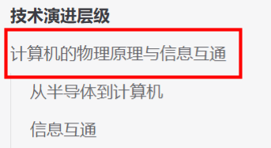

# 如何更好的阅读
本篇文档会说明技术演进层级系列文档（下称文档）中的讲述思路。以及一些文档细节，帮助你更好、更便捷的阅读、理解和查找内容。

* 如前文所属，每个层级会将内容分为计算和网络两个维度讲解，但并没有明确的分割，因为计算和网络是相互依托发展的。
* 每个维度的文档会按照使用需求到市场需求（从量变到质变）的顺序讲述，这些需求的解决方案便是这个层级的主要产出。
* 从第二层开始，每向上一层所使用的核心技术，基本都是前一层的主要产出。
* 下表是按照上述维度划分的手册内容概括，表格内容会随着手册内容的更新而更新。

::: tip
表中内容看不懂也没关系，每看完一个层级的内容回来看一下，就会有新的体会了。
:::

|层级|需求	|层级产出|
|:--:|:--:|:--:|
|计算的物理原理与信息互通|快速运算->可编程通用计算机|半导体、逻辑电路、集成电路、CPU、冯诺依曼体系结构、通用PC和专用设备|
|编程语言与系统能力|抽象高级语言->快速可重用的通用能力|高级编程语言和操作系统|
|原生应用和软件产品|从科学计算到生活需求->应用开发和数据持久化|软件应用商品、库和框架|
|软件行业和互联网的通用服务|大算力需求和更便捷的能力获取->大数据和超算集群|中间件、互联网和微服务、PaaS、SaaS和云计算|
|AI|一脑多用和数据互通->简便算力、智能调度、万物互联|大模型、AIGC、物联网、多模态多能力AI、超算中心、统一物联网系统|

## 文中样式
文档中除了正文和标题外会有不同的样式，下面列举了这些样式的内容，以帮助你更容易的阅读文档。

### 主线和支线
每个文档标题后会有类似<Badge type="warning" text="主线1/2" />的标志。
* 主线：表示本篇文档是本层级内必须要且要首先了解的内容。如果你没有技术背景，尽量不要忽略它。
::: details 注意每个层级的目录节点通常是本层级的第一篇主线，通常会介绍本层级的大致内容。

:::
* 支线：表示本篇文档是本层级内非必要了解的内容，通常知识深度深，涉及内容比较具体，可以按需阅读。
* 1/2：表示本篇文档是主线或支线的联合文档，1表示顺序，2表示总数。

### Coming Soon
::: tip :tada:
Coming Soon~!   
此标记表示文档内容正在生产中，即使有内容也不代表是定稿版。
:::

### 引用
> 此样式中的内容为引用，大多由AI或搜索百科、科普等文章提供。常用于说明知识背景和铺垫。

### 碎片关键词
::: details 碎片关键词
每个重要章节或重要的内容节点的最后都会有一个碎片关键词的折叠框，里面是章节内所讲述的知识点关键词，因为篇幅和知识深度等原因无法在文章中全部展开。可能会有电影、书籍、演讲视频和一些概念。有兴趣深度探索知识的朋友，可以参考这些关键词给出的方向。
:::

### tip
::: tip
tips 是上文中提到知识点的额外补充。
:::
